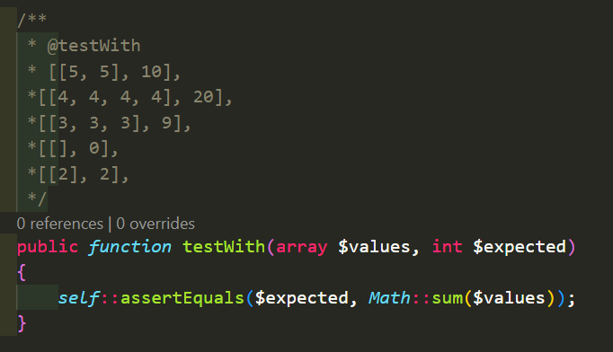
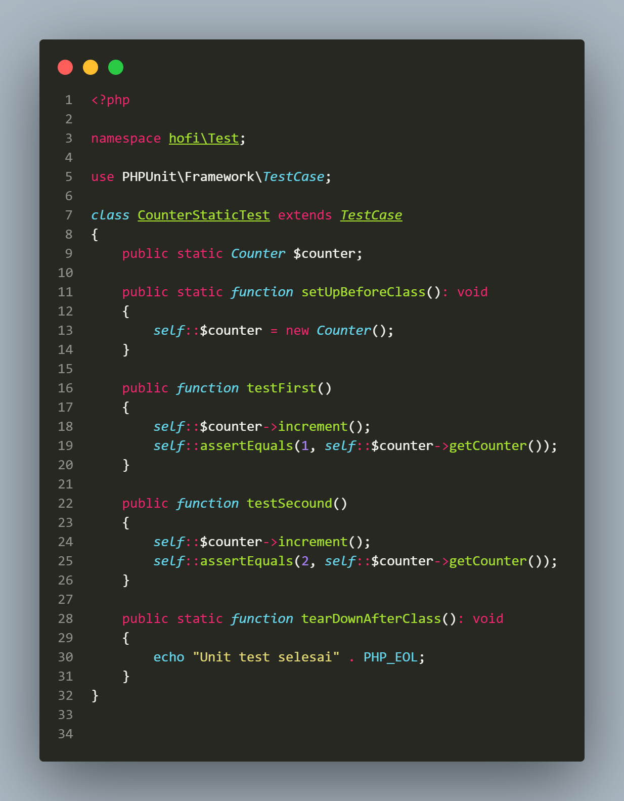

# PHP UNIT TEST

## A. POINT UTAMA

### 1. Software Testing

- Tujuan dari _software testing_ adalah memastikan kode pada aplikasi kita berjalan dengan baik.

---

### 2. Unit Test

- _Unit test_ biasanya menguji kode program terkecil seperti _method_.

- _Unit test_ digunakan sebagai cara untuk meningkatkan kualitas kode program kita.

---

### 3. PHP Unit Test

- Di PHP tidak memiliki fitur unit test secara default, jadi untuk mengimplementasikan unit test bisanya menggunakan _library_ atau _framework_ di PHP.

- PHP unit itu juga merupakan _framework_ yang sudah terintegrasi dengan `composer`.

- Untuk menginstall `PHPUnit`, kita bisa menambahkan _dependency_ `PHPUnit` pada bagian `dev`, karena `PHPUnit` hanya untuk development.

- Secara default setelah menginstall `PHPUnit` akan ada folder `bin` di dalam `vendor` yang berisi _binary_ file `PHPUnit` yang bisa digunakan untuk menjalankan `PHPUnit`.

- Kode php unit

  

- File php unit

  

---

### 4. Membuat Unit Test

1. Autoload

   - Biasakan untuk membedakan lokasi tempat source code PHP kita dengan source code Unit Test.

   - Biasanya dengan membuta folder `tests` untuk menyimpan semua unit test nya.

- Kode setup autoload

  

- Untuk membuat unit test, biasanya kita akan membuat _class_ turunan dari `PHPUnit\Framework\TestCse`.

  

- Unit test class counter

  

- Cara menjalankanya gunakan _binary_ file PHPUnit yang ada didalam folder `vendor/bin`. Gunakan perintah `php vendor/bin/phpunit test/CounterTest.php` untuk windows.

  

- Menjalankan unit test per _method_

  - Gunakan perintah `vendor/bin/phpunit--filter'ClassTest::testMethod'test/ClassTest.php`

  

---

### 5. Assertions

- `Assertion` adalah pengetesan apakah sebuah kondisi sudah terpenuhi, jika tidak terpenuhi maka unit test dianggap gagal.

- Kita bisa menggunakan _class_ yang sudah disediakan oleh PHPUnit bernama `Assert`. Yang berada didalam `PHPUnit/Framework/Assert`.

Assert di TestCase

- TestCase itu sendiri merupakan turunan dari _class_ `Assert`.

- Jadi kita bisa menggunakan _function-function_ `assertions` langsung dari unit test menggunakan `$this` atau `self`.

- Kode `Assert` di TestCase

  

---

### 6. Annotation

- PHO unit juga mendukung fitur `annotation`, yaitu infotmasi yang dapat dimasukan kedalam source code, dimana di PHP `annotation` ditempatkan pada _(block komentar)_.

- `@test` merupakan salah satu `annotation` yang menandakan bahwa unit test ini adalah sebuah unit test.

- Dengan `@test` kita tidak perlu lagi membuat nama _function_ yang selalu diawalai kata _test_.

  

---

### 7. Test Dependency

- Di PHPUnit bisa membuat unit test sebelumnya atau bahkan tergantung unit test sebelumnya.

- Untuk melakukan itu, kita gunakan annotation `@depends`.

  

---

### 8. Data Provider

- Di PHPUnit mendukung fitur `data provider` dimana bisa membuat unit test dengan _parameter_ dan datanya di provide dari _function_ lain.

- Untuk melakukannya bisa menggunakan annotation `@dataProvider providerFunction`.

- Kode data provider

  

- Kode Unit test data provider secara manual

  

- Kode unit test dengan data provider

  

- Kode unit test dengan data provider

  

Annotation `@testWith`

- Kita bisa gunakan `@testWith` untuk pengganti _function_ saat menggunakan `@dataProvider`.

  

---

### 9. Test Exception

- PHPUnit memiliki fitur assertion untuk memastikan bahwa sebuah exception harus terjadi jika terjadi, maka unit test dianggap gagal.

- kita bisa menggunakan function `Assert::expectException(ClassException::class)` jika ingin memastikan bahwa sebuah unit test harus terjadi exception yang kita perkirakan.

- Kode exception

  

- Kode test exception

  

---

### 10. Test Output

- PHPUnit memiliki fitur untuk mendeteksi `output`, dengan demikian kita bisa memastikan bahwa `output` yang dihasilkan sesuai dengan yang diinginkan.

- Gunakan perintah `Assert::expectOutputString('string')`.

- Contoh kode

  

- Kode test output

  

---

### 11. Fixture

- `Fixture` adalah membuat kode awal atau akhir saata membuat unit test.

- _Class_ testCase memiliki sebuah _function_ bernama `setUp()`. Ini merupakan _function_ yang selalu dipanggil sebelum unit test dieksekusi.

- _Function_ `setUp()` cocok sekali untuk membuat kode yang kita inginkan sebelum unit test dijalankan.

  

Annotation `@before`

- Kita bisa membuat _function_ dengan nama yang berbeda, jika menggunakan annotation `@before`.

- Dan juga kita bisa membuat _function_ `setUp` lebih dari satu.

  

- Kode fixture

  

TearDown() _function_

- _Function_ `tearDown()` adalah _function_ yang akan selalu dipanggil setelah unit test dieksekusi.

- Selain menggunakan _function_ ini, kita bisa menggunakan annotation `@after`.

- Kode `tearDown`

  

- Kode `after`

  

---

### 12. Sharing Fixture

- Fixture dalam PHPUnit adalah data awal yang diperlukan untuk menguji fungsionalitas kode.

- Kita dapat menggunakan fixture untuk mempersiapkan lingkungan tes yang konsisten sebelum menjalankan setiap tes.

- Gunakan _function_ `setUpBeforeClass()` untuk setup awal ketika _class_ unit test dieksekusi, atau gunakan `@beforeClass`.

- Lalu _function_ `tearDownClaa()` untuk dipanggil terakhir ketika _class_ unit test selesai, atau gunakan `@afterClass`.

- Kode `Sharing Fixture`

  

---

### 13. Incomplete Test

- Secara default jika kita membuta unit test dan belum selesai dan ingin pindah ke unit test lain PHP akan menganggap bahwa unit test sudah selesai.

- Nah ada baiknya kita memberi tahu ke PHPUnit bahwa unit test tersebut belum selesai dengan menggunakan _method_ `Assert::markTestIncomplete()`.

  

---

### 14. Skip Test

- Adab cara untuk mendisable unit test, dengan menggunakan `Assert::markTestSkip()`, dimana nanti akan ada laporan bahwa unit test tersebut di skip.

  

Skip bedasarkan kondisi

- PHPUnit mendukung melakukan skip unit test pada kondisi tertentu.

- Gunakan annotation `@requires` diikuti dengan tipe kondisi.

- Dan beberapa kondisi mendukung operasi perbandingan.

- Parameter `@requires`

  

- Contoh kode `@requires` Only Windows

  

- Contoh Kode `@requires` Mac & PHP 8

  

---

### 15. Stub

- Saat akan membuat test untuk sebuah _class_, dan ternyata _class_ tersebut butuh _dependency_ object lain, maka kita bisa membuat object pengganti yang bisa kita konfigurasi agar sesuai dengan keinginan kita.

- Teknik ini dinamakan stubbing, dan object pengganti yang kita buat disebut `stub`.

- kode product

  

- Kode product ke repository

  

- Kode product Service

  

- Kode membuat Stub

  

- Kode Konfigurasi Stub

  

- Kode konfigurasi stub dengan map

  

  

- Kode konfigurasi stub dengan callback

  

- Kode product service test sukses

  

- Kode product service test gagal

  

---

### 16. Mock Object

Masalah dengan stub

- Ada satu masalah yang terdapat di stub, yaitu kita tidak bisa mengetahui berapa kali berinteraksi terjadi terhadap object stub tersebut.

  

- Kode unit test delete dengan stub

  

  

- Mock Object sama seperti stub, hanya saja pada mock object bisa melakukan verifikasi berapa banyak method dipanggil.

- Gunakan perintah `createMock(class)`  
  yang terdapat pada _class_ TestCase.
  

Konfigurasi Mock object

- Dengan menambahkan `expects(invocationRule)` sebagai ekspetasi berapa kali _function_ dipanggil.

- Invocation Rule

  

- Kode membuat mock object

  

- Konfiguarasi mock object

  

- Integrasi dengan mock object

  

- Memastikan parameter benar

  

- Mock Trait & Abstrack _Class_

  1. Gunakan _function_ `getMockForTrait(trait)` untuk membuat mock object dari trait.

  2. Dan _function_ `getMockForAbstractClass(abstractclass)` untuk membuat mock object dari abstract class.

- Configuration

  1. PHPUnit mendukung file konfigurasi, dimana kita bisa menambahkan konfigurasi untuk PHPUnit.

  2. File ini biasanya berbentuk `XML`, dan biasanya namanya `phpunit.xml`.

  3. Buat file baru bernama `phpunit.xml`.

  4. Dan cara menjalankannya dengan menggunakan perintah `phpunit --configuration phpunit.xml`

  

- Integrasi dengan composer script

  

---

### 17. Test Suite

- Test Suite itu seperti grup atau fitur dalam unit test, contohnya jika kita ingin membedakan antara grup tiap fitur unit test kita.

  

- Kode menjalankan test suite tertentu

  

---

## B. PERTANYAAN & CATATAN TAMBAHAN

- Saya cukup kesulitan mengikuti vidio php unit test, dikarenakan berbeda text editor, apa lebih baik menggunakan text editor `PHPStrom` untuk pengkodean PHP, atau mungkin ada shortcut untuk mempermudah menggunakan VSCode?

---

## C. KESIMPULAN

- PHP Unit Test bisa mempermudah developer dalam mengetes aplikasi sebelum tahap lainnya, dikarenakan PHP Unit Test juga terintegrasi dengan baik dengan berbagai macam tools pendukungnya.
